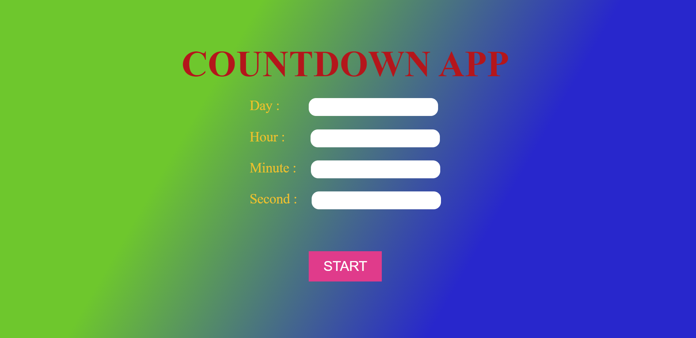
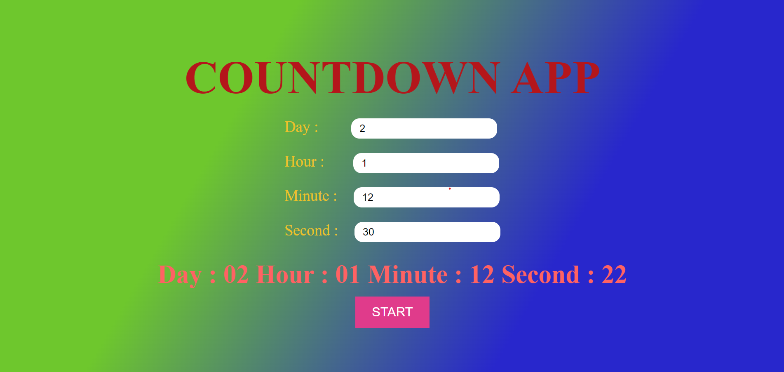

## What to build

we have to build CountDown App.

## Input

## Techanology used

we have used HTML, CSS and JavaScript DOM

## What I have learned from this project

I have learned how to design countdown app. I have learn how calling a function while clicking on button and how to use setInterval and how to kill this setInterval.

## Output

### Instructor

**Hitesh choudhary**
